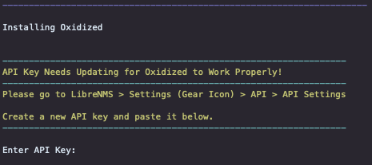

# NTS (Network T-Shoot Server)
- [NTS (Network T-Shoot Server)](#nts-network-tshoot-server)
  - [Introduction](#introduction)
  - [Features](#features)
    - [Docker Installer](#docker-installer)
    - [NTS Installer](#nts-installer)
    - [Open-Source Projects Used](#opensource-projects-used)
  - [Network Configuration](#network-configuration)
  - [Prerequisites and Assumptions](#prerequisites-and-assumptions)
  - [Installation](#installation)
    - [NTS Installation Process](#nts-installation-process)
      - [NTS Installer](#nts-installer)
      - [NTS Password](#nts-password)
      - [Netdisco Authentication](#netdisco-authentication)
      - [LibreNMS Admin](#librenms-admin)
      - [LibreNMS and Oxidized](#librenms-and-oxidized)
      - [LibreNMS and Syslog Server](#librenms-and-syslog-server)
      - [Finish Installation](#finish-installation)
  - [Post-Installation Configuration](#postinstallation-configuration)
    - [Netdisco](#netdisco)
    - [LibreNMS](#librenms)
      - [LibreNMS and Oxidized](#librenms-and-oxidized)
    - [LibreSpeed](#librespeed)
    - [Oxidized](#oxidized)
    - [NGINX](#nginx)
    - [Directory Structure](#directory-structure)
  - [Uninstallation/Cleanup Script](#uninstallationcleanup-script)
    - [Interactive Mode](#interactive-mode)
    - [Automatic Mode](#automatic-mode)
      - [NTS Mode](#nts-mode)
      - [Full Mode](#full-mode)
  - [Troubleshooting](#troubleshooting)
  - [Contributing](#contributing)
  - [Image Disclaimers](#image-disclaimers)
  - [ChatGPT Disclaimer](#chatgpt-disclaimer)
  - [License](#license)

## Introduction
NTS (Network T-Shoot Server) is a compilation of several open source network monitoring and management services designed to help with network troubleshooting and diagnostics. This script automates the setup and configuration of the NTS server. The project was conceived when I wanted to deploy some monitoring services for a customer in order to troubleshooting a diagnose some various strange network issues. 

## Features

### Docker Installer
- Docker installation wrapper script (install_docker.sh)
- Clones official Docker installer script and runs script
- Sets up and adds first Ubuntu user (UID 1000) to Docker group

### NTS Installer
- Interactive script that deploys and configures:
  - Netdisco
    - Network monitoring service that tracks and inventories network devices, device endpoints
  - LibreSpeed
    - Perform bandwidth monitoring tests
    - Stores tests in database for bandwidth tracking
  - LibreNMS
    - Monitoring of devices and interfaces via SNMP
    - Configure various system tests
    - Syslog server
    - Discover and monitor FIB and ARP tables
  - NGINX
    - Provides front-end interface to Netdisco, LibreSpeed, and LibreNMS
    - Configures reverse proxy for SNI-forwarded requests
- Installs CLI tools including
  - hping3 
  - tshark 
  - iperf3
  - iftop
  - nmap 
  - net-tools (arp, ifconfig, netstat, rarp, nameif and route)
- Dependencies for various features including:
  - apache2-utils
  - sqlite3

### Open-Source Projects Used

NTS Uses the following open-source projects:

<table style="width: 100%; text-align: center; border-collapse: collapse; border: none;">
  <tr style="border: none;">
    <td valign="top" style="border: none;">
        
        <ul style="list-style: none; padding: 0;">
            <li><a href="https://github.com/netdisco/netdisco">Netdisco GitHub</a></li>
            <li><a href="https://hub.docker.com/r/netdisco/netdisco">Netdisco Docker</a></li>
        </ul>
    </td>
    <td valign="top" style="border: none;">
      
      <ul style="list-style: none; padding: 0;">
        <li><a href="https://github.com/librespeed/speedtest">LibreSpeed GitHub</a></li>
        <li><a href="https://hub.docker.com/r/linuxserver/librespeed">LibreSpeed Docker</a><br>
        (Managed by <a href="https://www.linuxserver.io/">Linuxserver.io</a>)</li>
      </ul>
    </td>
    <td valign="top" style="border: none;">
      
      <ul style="list-style: none; padding: 0;">
        <li><a href="https://github.com/librenms/librenms">LibreNMS GitHub</a></li>
        <li><a href="https://www.librenms.org/">LibreNMS</a></li>
      </ul>
    </td>
  </tr>
  <tr style="border: none;">
    <td valign="top" style="border: none;">
      
      <ul style="list-style: none; padding: 0;">
        <li><a href="https://github.com/ytti/oxidized">Oxidized GitHub</a></li>
        <li><a href="https://community.librenms.org/c/help/oxidized/10">LibreNMS Oxidized Forum</a></li>
      </ul>
    </td>
    <td valign="top" style="border: none;">
      
      <ul style="list-style: none; padding: 0;">
        <li><a href="https://nginx.org/en/">NGINX</a></li>
        <li><a href="https://hub.docker.com/_/nginx">NGINX Docker</a></li>
      </ul>
    </td>
    <td valign="top" style="border: none;">
      
      <ul style="list-style: none; padding: 0;">
        <li><a href="https://github.com/docker/docker-install">Docker Installation Script</a></li>
        <li><a href="https://github.com/docker">Docker GitHub</a></li>
      </ul>
    </td>
  </tr>
</table>

## Network Configuration

NTS networking is configured with:

- UFW rules to restrict access to only ports needed to access the various services
  - tcp 80/443 - Main index page and SNI redirection to other services
  - tcp/udp 514 - Syslog services on LibreNMS
  - tcp 5000 - Netdisco
  - tcp 8000 - LibreNMS
  - tcp 8080 - LibreSpeed
  - tcp 8888 - Oxdized, but used only by LibreNMS for API access
  - tcp 22 - SSH to OpenSSH Server on NTS
  - All outbound traffic allowed
- NGINX is configured to various services including
  - Hosting index page with links to Netdisco, LibreNMS, and LibreSpeed via their IP/tcp port
  - Configured to perform SNI redirection for all services by prepending the service name and a dash to the front of each service
    - e.g., Netdisco -> netdisco-ntsserver.example.com
    - This can be customized for your own purposes
- A self-signed TLS certificate is generated that includes
  - Hostname of the server
  - FQDN of the server
  - IP address of the server
  - SNI for Netdisco, LibreNMS, and LibreSpeed
    - Netdisco -> netdisco-(server_fqdn), e.g., netdisco-nts.exmaple.com
    - LibreNMS -> libreNMS-(server_fqdn), e.g., librenms-nts.exmaple.com
    - LibreSpeed -> librespeed-(server_fqdn), e.g., librespeed-nts.exmaple.com


## Prerequisites and Assumptions
- Clean and fresh installation [64-bit Ubuntu 22.04 LTS](https://releases.ubuntu.com/jammy/) (Possibly expanded to other distributions/releases in the future). This does not work on ARM/ARM-based architectures.
  - This is absolutely required to install Docker CE and LibreNMS. 4
- Project was designed to be deployed in a VM, not bare-metal hardware. Not saying it can't be done, but it's outside the (current) scope of this project.
- NTS installer requires Docker CE (commiunity edition). A Docker installer script is included in this project, but not required.
  - Instructions for manual installation of Docker on Ubuntu can be found [here](https://docs.docker.com/engine/install/ubuntu/). 
- There is an assumption -- although not entirely necessary -- that you are already familiar with Netdisco, LibreNMS, LibreSpeed, Oxidized, NGINX, and Docker. This project aims to simplify the deployment of those services for quick monitoring. 

## Installation
To install the NTS server, follow these steps:

1. Perform a fresh installation of Ubuntu 22.04 LTS.
2. Clone the repository:
    ```sh
    git clone https://github.com/compunet-jimmy/nts
    cd nts
    ```
3. Configure the scripts to be executable:
    ```sh
    sudo chmod +x *.sh
    ```
    or
    ```sh
    sudo chmod +x install_docker.sh
    sudo chmod +x install_nts.sh
    sudo chmod +x uninstall_nts.sh
    ```
4. If Docker is not installed yet, run the following (skip to step 5 if Docker is already installed):
    ```sh
    sudo ./install_docker.sh
    ```
5. Run the installation script:
    ```sh
    sudo ./install_nts.sh
    ```

### NTS Installation Process

Certain components of the installation require some input from the user due to the naunces of each project, or security requirements. Below will address all interactive parts of the installation script.

#### NTS Installer

The installer will ask if you're ready to proceed with installation. 


#### NTS Password

You will be prompted to enter a password that is used for all services. This password is stored as a system variable in `/etc/environment` as `NTS_PASSWORD`. 


> [!NOTE]
> If you do not enter a password, the default password `ntsRibbon1893` is used. 

#### Netdisco Authentication

By default, the Netdisco Docker container does not enable authentication. You will be prompted to enable or not enable authentication (default is to **not** enable authentication).


If you choose to enable authentication, the NTS installer will pause and wait for any key to be pressed before proceeding with installation. During this pause, you should navigate to the the Netdisco instance (https://<server_ip>:5000) and go to Admin > User Management.

Configure your admin user and be sure to enable it as 'Administrator'.

This is also a good time to disable guest as administrator.

#### LibreNMS Admin


An automatic way to create a LibreNMS admin is a difficult process, so it was opted to require manual entry. Go to the LibreNMS instance (https://<server_ip>:8000) and click the blue check mark. The password used for the nts-admin is the `NTS_PASSWORD` configured before. 


#### LibreNMS and Oxidized

In order for LibreNMS and Oxidized to work, Oxidized needs an API key configured in LibreNMS. LibreNMS uses this key to feed into Oxidized devices to perform configuration backups. Like before, this is no trivial task to automate with LibreNMS, so manual API key needs to be generated.



Login to LibreNMS (https://<server_ip>:8000) with the nts-admin account, and go to Settings (Gear Icon) > API > API Settings and create a new API key. Enter that key in the prompt and hit enter.


> [!NOTE]
> There is no hard requirement for LibreNMS to work with Oxidized. If you wish to disregard Oxidized for now, just enter random characters into the API prompt.

#### Finish Installation

After installer finishes, you will be presented with the web services configured by default. Press any key to finish.


## Post-Installation Configuration

For more information regarding configuration options for each project used, please see the documentation for each service. Some basic configuration is provided below for each service, but the information below is anything but exhaustive. 

### Netdisco
The main configuration file for Netdisco is `deployment.yml` located in `/opt/nts/netdisco/config`.

The following is an example configuration for SNMP and the CLI collector used for querying Palo Alto firewalls for their ARP table.

```yaml
device_auth:
  - tag: 'default_v2_readonly'
    community: 'public'
    read: true
    write: false
  - tag: 'someV2CommunityString'
    community: 'someV2CommunityString'
    read: true
    write: false
  - tag: sshcollector
    driver: cli
    platform: PaloAlto
    only: 10.1.2.51
    username: netdisco
    password: "SUPERSECRETPASSWORD"
```

Netdisco Documentation:

- [Netdisco Configuration](https://github.com/netdisco/netdisco/wiki/Configuration)

### LibreNMS

LibreNMS has a few different methods to configure SNMP credentials: web interface or the CLI (via `lnms` command). 

The most simple method is to configure it via the web interface. Go to Settings (Gear Icon) > Global Settings:


Then go to Poller > SNMP and configure SNMP v2 or v3 settings. 

SNMP settings can also be entered on a per-device basis when adding a device:


LibreNMS Documentation:

- [LibreNMS Docker](https://github.com/librenms/docker)
- [LibreNMS Configuration](https://docs.librenms.org/Support/Configuration/)

#### LibreNMS and Oxidized

LibreNMS is configured to reach out to Oxidized via the NTS server IP address at port 8888. 

#### LibreNMS and Syslog Server
The LibreNMS Docker installation installs the syslog-ng service and listens on both TCP and UDP port 514. The LibreNMS documentation below is an excellent source on this feature and includes information how to configure syslog forwarding for various make/model of devices. 

LibreNMS Syslog Documentation:

- [LibreNMS Syslog Documentation](https://docs.librenms.org/Extensions/Syslog/)

### LibreSpeed
LibreSpeed is installed to work right out of the box for throughput/network testing. The service is also installed with a backend database that uses sqlite3 to store the results of each LibreSpeed test.

The results page can be found at:

https://<server_ip>:8080/results/stats.php

Use the `NTS_PASSWORD` to login. 

LibreSpeed Documentation:

- [LibreSpeed Docker](https://github.com/linuxserver/docker-librespeed)
- [LibreSpeed Wiki](https://github.com/librespeed/speedtest/wiki)

### Oxidized
To complete the configuration for Oxidized, you'll need to configure a user account used by Oxidized to log-in to devices and before configuration backups. By default, an `oxidized` username is configured using the `NTS_PASSWORD`. The Oxidized configuration file (simply named `config` with no extension) is located in `/opt/nts/oxidized/config/`. 

```yaml
---
username: "oxidized"
password: "${NTS_PASSWORD}"
```

It is strongly suggested to replace this password with a unique password.

In addition, it is recommended to ensure this account has READ-ONLY permissions. 

Oxidized Documentation:

- [Oxidized GitHub](https://github.com/ytti/oxidized)
- [LibreNMS Oxidized Configuration](https://community.librenms.org/c/help/oxidized/10)

### NGINX
No additional configuration is necessarily needed with NGINX.

NGINX Documentation:

- [NGINX Documentation](https://nginx.org/en/docs/)

### Directory Structure

All configuration files, databases, etc. are stored in /opt/nts directory. Please see Docker compose files for additional information.

```sh
nts
├── librenms
│   ├── alert-templates
│   ├── config
│   ├── db
│   ├── logs
│   ├── monitoring-plugins
│   ├── plugins
│   ├── rrd
│   ├── syslog-ng
│   └── weathermap
├── librespeed
│   └── config
├── netdisco
│   ├── config
│   ├── logs
│   ├── nd-site-local
│   └── pgdata
├── nginx
│   ├── auth
│   ├── certs
│   ├── conf
│   ├── html
│   └── logs
└── oxidized
    └── config
```

## Uninstalltion/Cleanup Script
The uninstallation script is a cleanup script written to cleanup the server of the NTS installation, and the Docker installation if desired. The goal of this script is to provide a relatively clean slate for reinstallating NTS services and/or for creating a complete clean slate for NTS and Docker. 

The script has two modes of operation:

- NTS Mode
  - Destroys and removes all Docker containers created by NTS
  - Removes any ancillary services 
  - Removes any accounts/groups created by NTS
  - Removes all firewall rules and disables the UFW firewall
- Full Mode
  - Runs NTS mode (above)
  - Uninstalls and purges Docker installation
  - Reboots server

The script can operated two ways: interactively or automatically. 

### Interactive Mode
To operate the cleanup script interactively, just run the script (as root/sudo):

```sh
sudo ./uninstall_nts.sh
```

The script will then prompt you for what uninstallation mode you would like to run. The default mode is to only run an NTS cleanup.


### Automatic Mode
Automatic mode is simply a method to run the cleanup script non-interactively. The script will accept one of two parameters (case-insensitive): *NTS* or *FULL*.

To run automatically, simply pass the correct parameter. 

#### NTS Mode
```sh
sudo ./uninstall_nts.sh nts
```

#### Full Mode
```sh
sudo ./uninstall_nts.sh full
```

Passing the wrong parameter or too many parameters will cause the script to exit early.


## Troubleshooting
If you encounter any issues during the installation or while using the NTS server, consider the following steps:
- Ensure you have the necessary permissions to run the script.
- Check console for various messages.
- Check the log files for each service located in `/opt/nts` (Not all services have log files).
- Verify that all dependencies are correctly installed.

For additional support, please refer to the project's GitHub Issues page.

## Contributing
We welcome contributions to the NTS project. If you have an idea for a feature or have found a bug, please open an issue or submit a pull request.

## Image Disclaimers

> [!NOTE]
> The Netdisco and Oxidized logos were created by me. I wanted something to compliment the other logos and couldn't really find much.

## ChatGPT Disclaimer
This project, NTS, includes code that was developed in collaboration with ChatGPT services. While most of the code was written independently, some components and code snippets were generated with the assistance of ChatGPT. We have carefully reviewed and integrated these contributions to ensure they meet the project’s standards and requirements.

## License
This software is provided “as-is,” without warranty of any kind, express or implied, including but not limited to the warranties of merchantability, fitness for a particular purpose, and noninfringement. In no event shall the authors or copyright holders be liable for any claim, damages, or other liability, whether in an action of contract, tort, or otherwise, arising from, out of, or in connection with the software or the use or other dealings in the software. Use this software at your own risk.

This project is licensed under the MIT License. See the [LICENSE](LICENSE) file for details.
